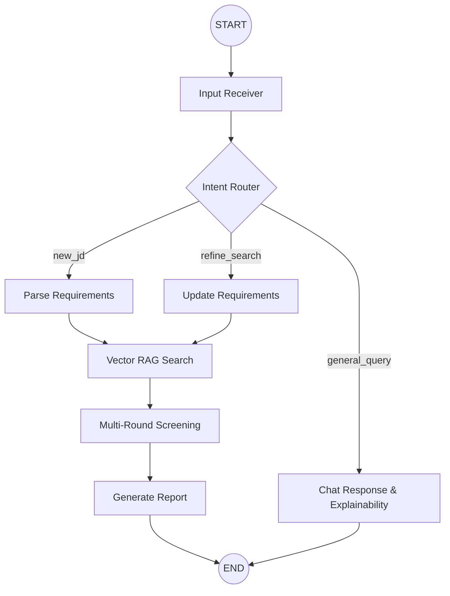

# AI Resume Matcher Pro

An advanced, agentic Retrieval-Augmented Generation (RAG) system built with **LangGraph** and **Streamlit**. This application evaluates candidate resumes against job descriptions through multi-round screening and provides a conversational interface for iterative refinement and explainability.

## 🚀 Features
- **Conversational Interface:** Submit raw job descriptions or ask questions in natural language.
- **Iterative Refinement:** Ask the agent to tweak requirements (e.g., "Make AWS a nice-to-have") and watch it re-rank candidates on the fly.
- **Holistic Screening Engine:** Evaluates candidates not just on a strict keyword checklist, but on overall JD alignment and experience depth.
- **Explainability:** Ask the agent *why* a candidate was hired or rejected, and it will explain its reasoning based on the generated comparative matrix.
- **Persistent Sessions:** Chat history is saved and restored automatically via URL parameters.

## 🧠 State Machine Architecture (LangGraph)

Below is the visual representation of our agent's decision-making flow:

## 🛡️ Security Features
- **API Key Protection:** Uses `.dotenv` and a strict `.gitignore` to prevent secret leakage.
- **XSS Prevention:** All user inputs are strictly sanitized and HTML-escaped before rendering in the Streamlit UI.
- **State Isolation:** Each user/tab is assigned a unique UUID to prevent cross-session data contamination.

## 🛠️ Tech Stack
- **UI:** Streamlit
- **Agent Framework:** LangChain & LangGraph
- **LLM:** Groq (llama-3.1-8b-instant)
- **Embeddings:** HuggingFace (`all-MiniLM-L6-v2`)
- **Vector DB:** ChromaDB
