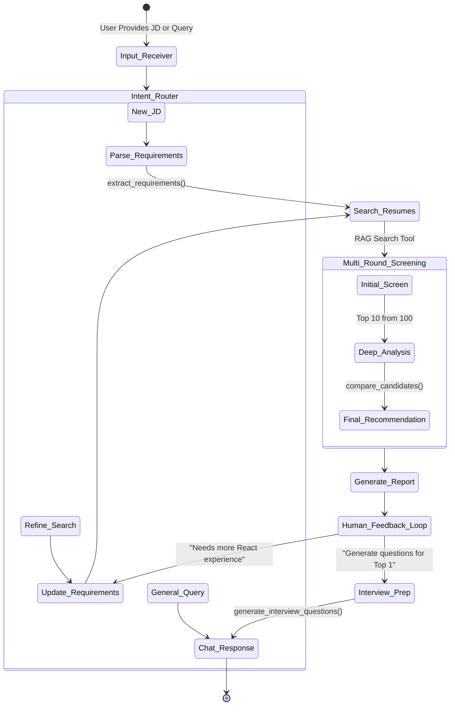

# AI-Powered Resume Matcher: Agentic Workflow Architecture

This document outlines the architecture for the **AI-Powered Resume Matcher and Assistant**, specifically focusing on the LangGraph-based agentic workflow outlined in the project requirements.

## 1. System Overview

The system transitions from a basic Retrieval-Augmented Generation (RAG) pipeline into a stateful, iterative Agent capable of reasoning, multi-round screening, and natural language interaction.

### Core Technology Stack:
- **Orchestration:** LangGraph (for stateful, cyclical agent workflows)
- **LLM Engine:** Groq (All generative tasks, reasoning, and conversational routing utilize Groq, specifically the `llama-3.1-8b-instant` model, for high-speed inference).
- **Embeddings & Vector Store:** HuggingFace / Chroma (from Milestone 2 RAG)
- **Frontend / Interface:** Streamlit, Gradio, or CLI

---

## 2. Agent State Management (`AgentState`)

LangGraph relies on a defined `State` object that gets passed between nodes. The state will maintain:

```python
class AgentState(TypedDict):
    messages: Annotated[Sequence[BaseMessage], add_messages] # Conversation history
    jd_raw: str                                              # Original Job Description
    extracted_requirements: dict                             # Parsed Must-haves & Nice-to-haves
    retrieved_candidates: list[dict]                         # Initial RAG results
    shortlist: list[dict]                                    # Filtered/Ranked candidates
    current_analysis: dict                                   # Reasoning, strengths, and gaps
    human_feedback: str                                      # Feedback from the recruiter
```

---

## 3. Workflow Graph (State Machine)

The LangGraph workflow consists of interconnected nodes (functions) and conditional edges (decision points). 

### Mermaid State Diagram



### Node Descriptions:
1. **Input_Receiver & Intent_Router:** Determines if the user is submitting a new JD, tweaking existing parameters, or asking a conversational question (e.g., "Why did John rank higher?").
2. **Parse_Requirements:** Uses the LLM to break down the raw JD into structured JSON (Must-Haves, Nice-to-Haves).
3. **Search_Resumes:** Interfaces with the Milestone 2 RAG system to pull a wide net of relevant resumes.
4. **Multi_Round_Screening:** 
    *   *Round 1:* Fast filtering of top `N` candidates based on keyword/semantic overlap.
    *   *Round 2:* LLM-driven deep analysis of the top tier, evaluating context and project depth.
    *   *Round 3:* Binary Hire/No-Hire recommendation scoring.
5. **Generate_Report:** Compiles the findings into a readable format (Strengths, Gaps, Improvement areas).
6. **Human_Feedback_Loop:** A dynamic break-point where the agent waits for user input. If the user changes criteria, the graph loops back.

---

## 4. Tool Ecosystem

The agent operates using a bound set of tools. When the LLM decides an action is needed, it invokes the relevant tool:

| Tool Name | Purpose | Underlying Mechanism |
| :--- | :--- | :--- |
| `fs_tools` | Read/Parse files | Milestone 1 Python file parsers (PDF, DOCX, TXT) |
| `rag_search` | Semantic candidate retrieval | Milestone 2 Chroma/HuggingFace Vector Store |
| `extract_requirements` | Parse JDs | Groq LLM structural extraction |
| `compare_candidates` | Head-to-head analysis | Prompt chain taking two candidate profiles and returning a comparative matrix |
| `generate_interview_questions`| Custom screening prep | Prompt chain taking JD + Candidate Gaps to generate targeted questions |

---

## 5. Interactive Features (Part B & C Execution)

*   **Conversational Memory:** By using LangGraph's built-in message checkpointing, the agent remembers context. E.g., if a user says, "Find candidates with React," and later says, "Actually, make it 5 years of experience," the agent updates the `extracted_requirements` state without forgetting the "React" requirement.
*   **Explainability Pipeline:** During the `Generate_Report` phase, the LLM is explicitly prompted to generate a `reasoning_trace`. This allows the agent to instantly answer follow-up queries like, "Why did Jane score low?" by reading from `State['current_analysis']`.
